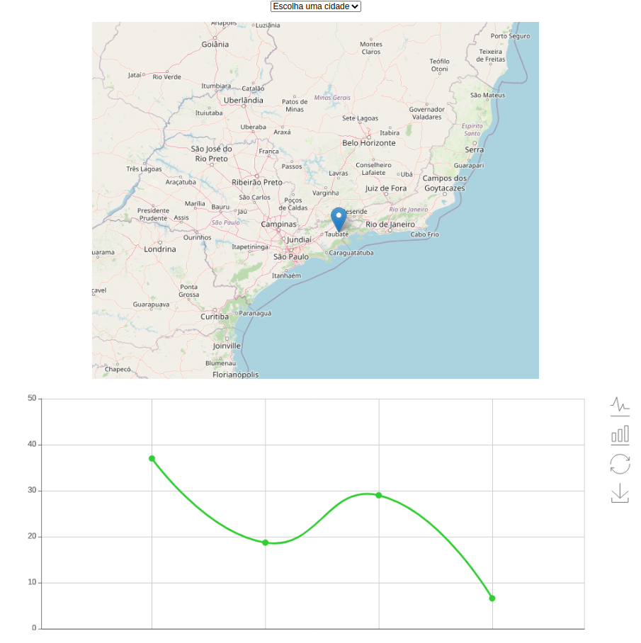

# Desafio Tempo OK Full-Stack

A tarefa é exibir o histórico de temperaturas registradas pela INMET em três cidades.

A sua página deve conter um elemento `select`, um mapa Leaflet, e um gráfico Apache ECharts.

Para conectar esses elementos, use o framework Vue.js

## Dados da API

Você deve obter dados dessas três estações do JSON [api_response.json](api_response.json) disponível nesse repositório. Os dados vêm do nosso sistema.

O JSON tem esse formato:

```
"created_at": "2020-11-24T14:21:22",
"stations": [{...}, {...}, {...}],
"timestamps": {...}
```

A informação de `stations` deve ser usada para compor a página. Cada `station` tem essa estrutura:

```
"data": {"air_temperature": [20, 19.5, 18.2, ...]},
"time: ["2020-11-15T00:00:00", "2020-11-15T01:00:00", "2020-11-15T02:00:00", ...],
"station": {
  "station_id": "br.inmet.A652",
  "name": "Rio De Janeiro - Forte De Copacabana",
  "latitude": -22.988285,
  "longitude": -43.190437,
  "city": "Rio De Janeiro",
  "state": "RJ",
  "network_acronym": "INMET",
  "basin": null
}
```

O comprimento de `air_temperature` e `time` são iguais; cada elemento de `air_temperature` corresponde ao horário do mesmo índice.

## Requisitos da página:

* O nome da cidade e estado de cada estação deve aparecer como uma opção do `select` (Exemplo: "Rio De Janeiro - RJ")

* Quando uma estação é selecionada, um marcador deve aparecer no mapa naquela latitude e longitude. O marcador deve mover quando a seleção é modificada (só deve existir um marcador visível no mapa).

* O gráfico também deve se atualizar com o `select` e exibir a temperatura na data e hora correta para a estação selecionada. Apenas os dados da cidade selecionada devem ser exibidos.

## Mapa OpenStreetMap

Para começar esse desafio, recomendamos usar o arquivo [openstreetmap.html](openstreetmap.html) deste repositório, que carregará um mapa simples.

## Exemplo

O arquivo [index.html](index.html) contém um exemplo mínimo dos requisitos. Você pode considerar outros layouts, como um menu, botões para exibir e ocultar o mapa ou gráfico, ou outras funcionalidades. 


